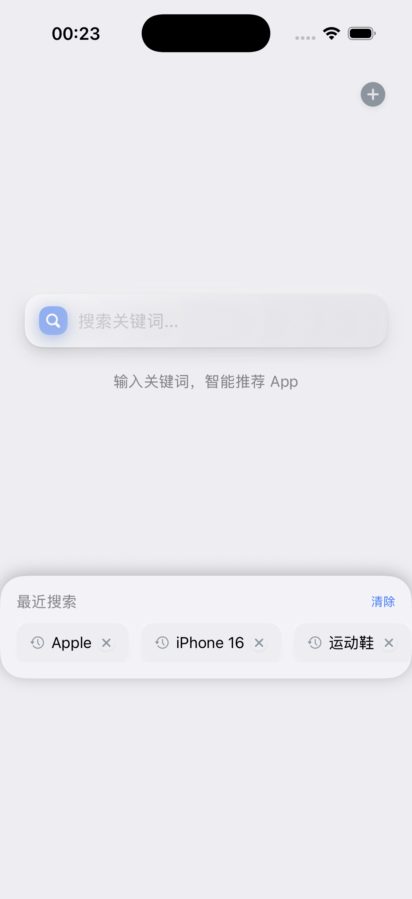
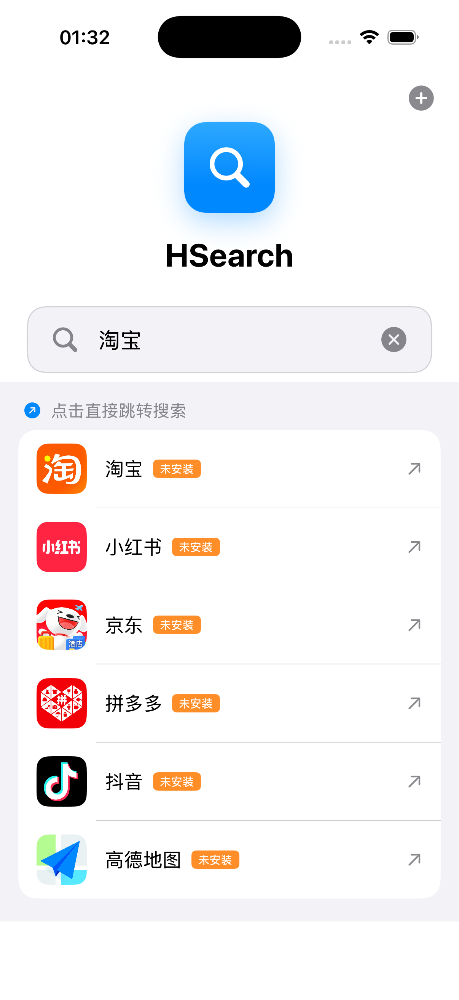

# HSearch

一款 iOS 智能搜索聚合 App，根据输入内容智能推荐合适的 App 并一键跳转搜索。

## 功能特性

- 🤖 **智能推荐** - 根据搜索内容自动推荐最合适的 App
- 🚀 **一键跳转** - 无需手动切换 App，直达搜索结果
- ➕ **自定义 App** - 支持添加和管理自定义 App
- 📱 **深度集成** - 支持淘宝、京东、小红书、抖音、微信、哔哩哔哩、知乎等热门应用
- 🎨 **拟物化设计** - 采用现代拟物化（Neumorphism）UI 风格
- 🖼️ **实时图标** - 从 App Store 自动获取应用图标

## 支持的应用

| App | 支持状态 | 说明 |
|-----|----------|------|
| 淘宝 | ✅ | 商品搜索 |
| 京东 | ✅ | 商品搜索 |
| 小红书 | ✅ | 内容搜索 |
| 抖音 | ✅ | 视频搜索 |
| 微信 | ✅ | 聊天内搜索 |
| 哔哩哔哩 | ✅ | 视频/UP主搜索 |
| 知乎 | ✅ | 问答搜索 |
| 高德地图 | ✅ | 地点搜索 |
| 百度地图 | ✅ | 地点搜索 |
| 拼多多 | ✅ | 商品搜索 |

## 智能分类

应用内置实体分类器，可识别以下类型：
- 📍 **地点** - 自动推荐地图类 App
- 🏷️ **品牌** - 自动推荐购物类 App
- 👤 **人物** - 自动推荐社交/视频类 App
- 📱 **App 名称** - 直接跳转到对应 App

## 技术栈

- **语言**: Swift 5.0
- **框架**: SwiftUI
- **平台**: iOS 16.0+
- **开发环境**: Xcode 15.0+
- **架构**: MVVM

## 项目结构

```
HSearch/
├── HSearch/
│   ├── HSearchApp.swift              # App 入口
│   ├── ContentView.swift             # 主界面（拟物化 UI）
│   ├── SearchViewModel.swift         # 搜索逻辑与数据管理
│   ├── AddAppView.swift              # 添加自定义 App
│   ├── EntityClassifier.swift        # 实体分类器
│   ├── Info.plist                    # 配置文件
│   ├── Assets.xcassets/              # 资源文件
│   └── Preview Content/              # 预览资源
├── HSearch.xcodeproj/                # Xcode 项目
├── README.md                         # 项目说明
├── WORKFLOW.md                       # 协作流程
└── screenshot_*.png                  # 截图文件
```

## 开发状态

- [x] 基础搜索界面
- [x] App 跳转功能
- [x] 自定义 App 支持
- [x] 搜索历史记录
- [x] 智能推荐算法
- [x] 拟物化 UI 设计
- [x] App Store 图标获取
- [x] 实体分类器（品牌/地点/人物）
- [ ] 真机测试
- [ ] TestFlight 分发
- [ ] App Store 上架

## 截图展示

| 主界面 | 搜索推荐 | 添加 App |
|--------|----------|----------|
|  |  |  |

更多截图见项目根目录 `screenshot_*.png` 文件。

## 安装方式

### 方式一：Xcode 直接运行（开发）
1. 克隆仓库
2. 用 Xcode 打开 `HSearch.xcodeproj`
3. 连接 iPhone，选择真机设备
4. 点击 Run 运行

### 方式二：TestFlight（即将推出）
- 等待 TestFlight 测试邀请

## GitHub 仓库

https://github.com/unclesamsCream/Hsearch

## 更新日志

### 2026-03-27
- 优化拟物化 UI 设计
- 完善 App Store 图标获取逻辑
- 准备 TestFlight 分发

### 2026-03-19
- 实现智能推荐算法（基于关键词匹配）
- 支持实体类型识别（品牌、地点、人物等）
- 优化 UI 交互体验

### 2026-03-14
- 初始化项目
- 实现基础搜索功能
- 支持多个热门 App 跳转

---
*最后更新: 2026-03-27*
